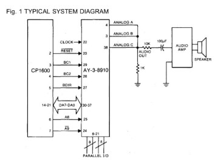

## **Basic KC89C72 (Clone of GI AY-3-8910) Driver with '595 for Arduino**
-----
Thanks to Matio Klingemann for the AY-3-8910 sketch: https://github.com/Quasimondo/Arduino-Sketches/tree/master/AY-3-8910%20Sound%20Chip/Quarzless%20Control

I have modified the schematic (**fritzingBreadboardSchematics.png**) provided in the git to prevent distortions when mixing three sound channels. The modification is simple: only 1K resistor to the ground at the mixed output.

Reference: https://electronics.stackexchange.com/questions/171361/why-does-my-ay-3-8910-sound-so-distorted
